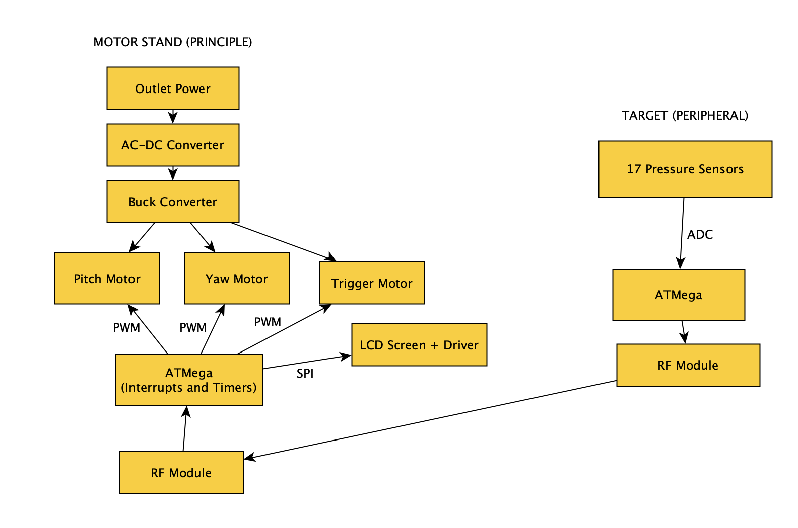
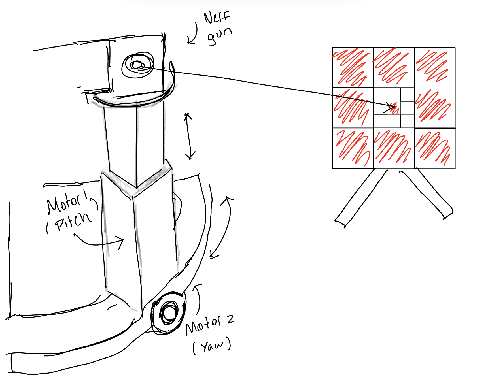
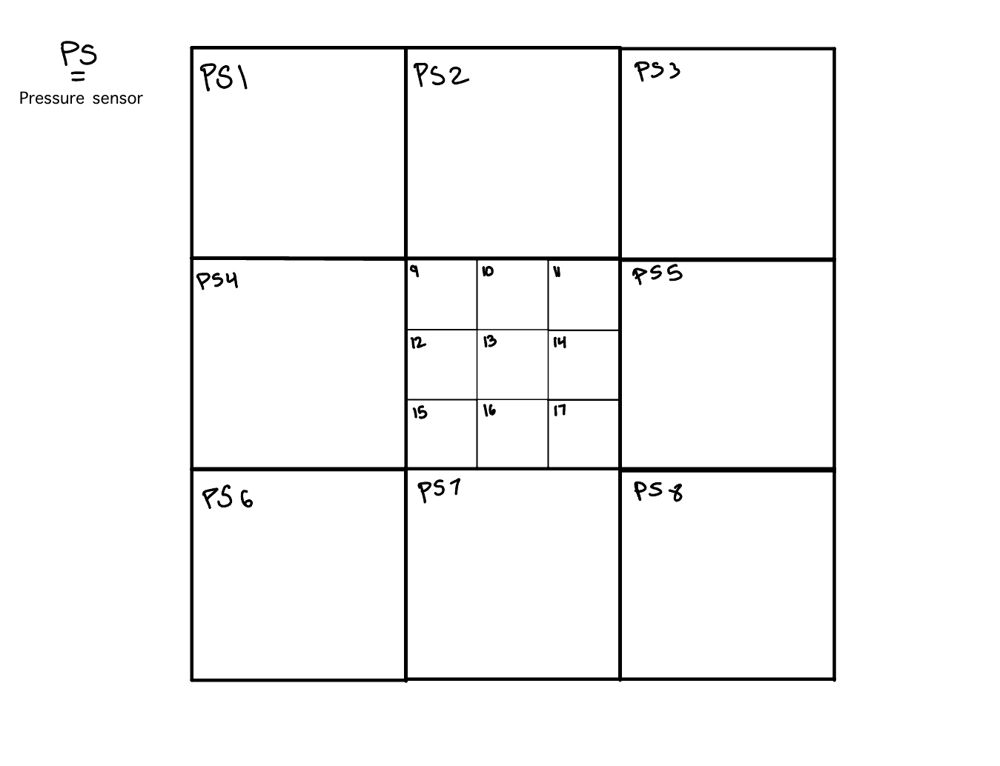
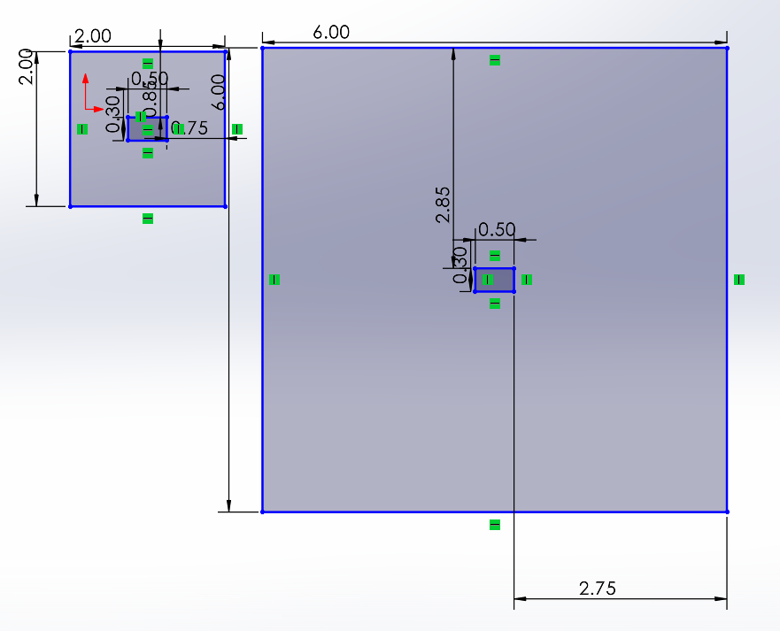
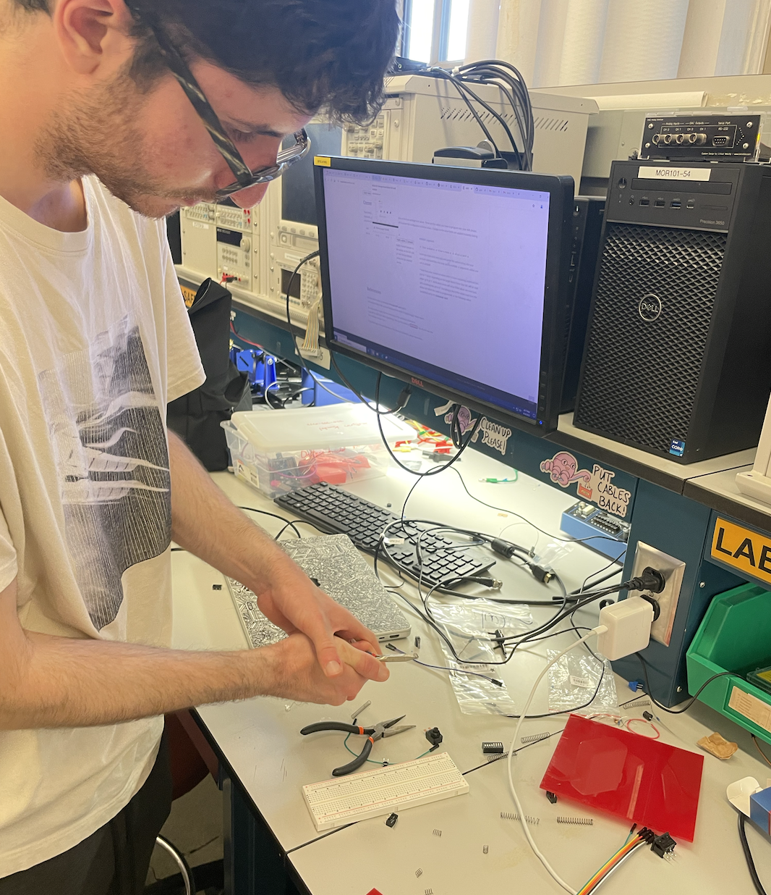
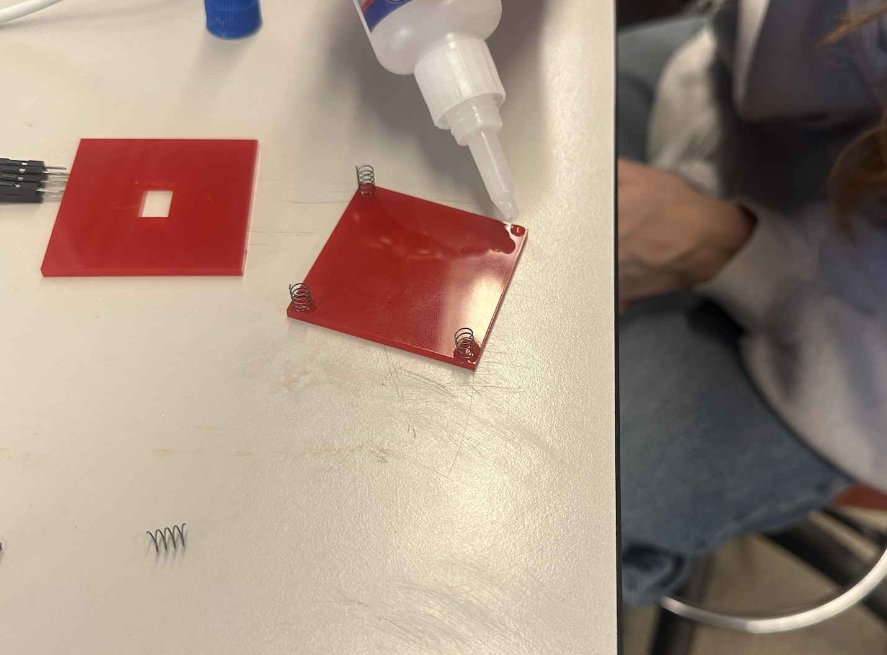
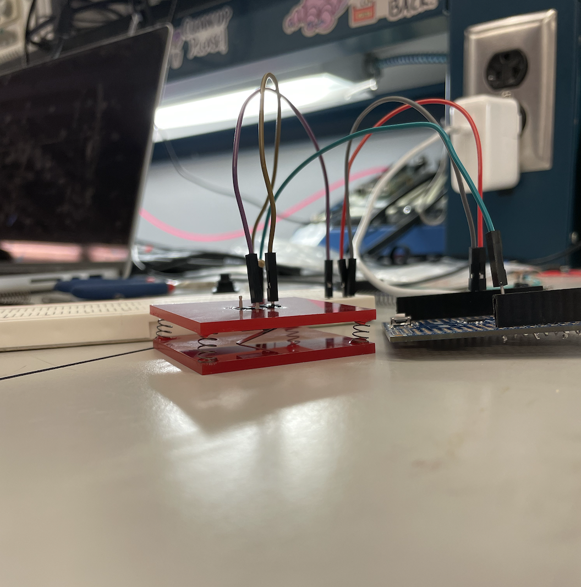
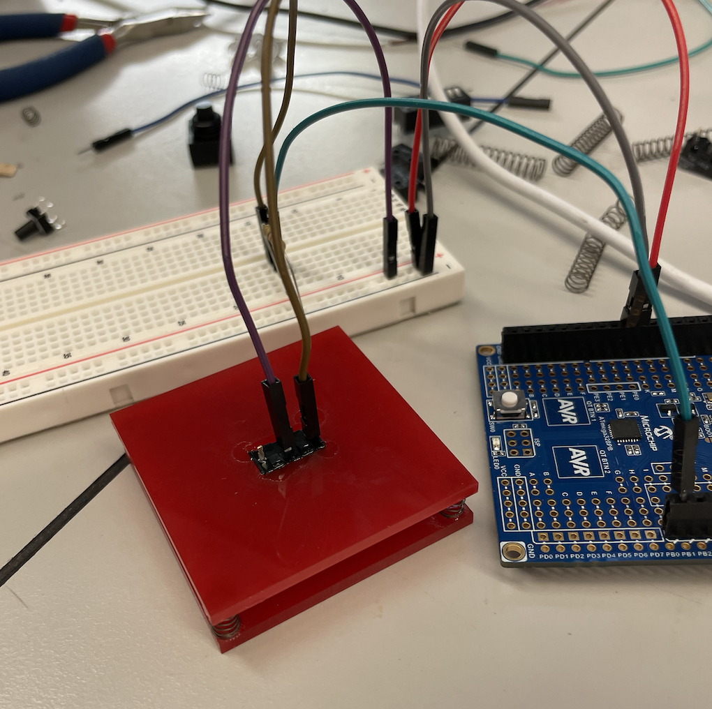
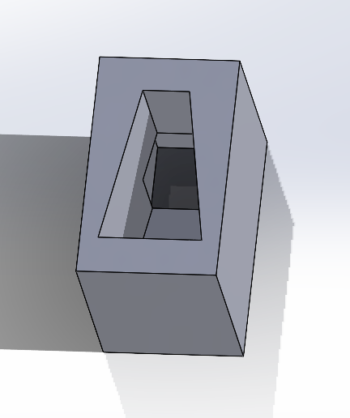
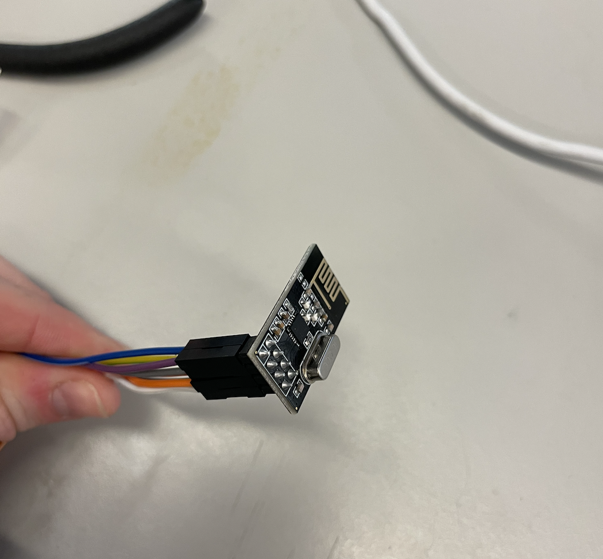

# AutoAlign

and a target that is covered in pressure sensors which send data back to the motors of the stand to readjust its positioning.

- Team Number: 3
- Team Name: AutoAlign
- Team Members: Ayan Bhatia, Matilda Dingemans, Destynn Keuchel
- GitHub Repository URL: [https://github.com/upenn-embedded/final-project-s25-autoalign](https://github.com/upenn-embedded/final-project-s25-autoalign)
- GitHub Pages Website URL: [for final submission]

  

## Final Project Proposal

### 1. Abstract

Our project is an adaptive targeting system that uses pressure sensor feedback to automatically realign a motor-controlled platform that holds a nerf gun toward the center of a target. It will consist of two functional pieces that communicate with eachother. The first will be a Nerf Toy Gun stand that can move where the Nerf Gun points up, down, left, and right. The second will be a target that is covered in pressure sensors that sends information back to the stand to so it realigns itself for the next shot to be more accurate.

### 2. Motivation

_What is the problem that you are trying to solve? Why is this project interesting? What is the intended purpose?_

The problem we are solving is the aiming of a projectile, and the purpose of our project will be to orient a nerf gun to hit a target. We are doing so by controlling a nerf gun with a 2-axis motor system informed by feedback from a peripheral target device.

  

### 3. System Block Diagram

  

### 4. Design Sketches

The motor stand will be 3D printed. We will use Solidworks to design our stand and the RPL to print. We will laser cut wood for the target to place the pressure sensors on.

Motor Stand:

Target:

  

### 5. Software Requirements Specification (SRS)

- Coordinates of impact sent from peripheral ATMega to principal ATMega
- Impact on pressure sensor must ping an interrupt in the peripheral ATMega
- The principal ATMega controls directional motors via PWM
- Principal ATMega uses a timer to pull the trigger on the nerf gun after a set amount of time of the peripheral recieving input

**5.1 Definitions, Abbreviations**

Here, you will define any special terms, acronyms, or abbreviations you plan to use for hardware

PWM - Pulse Width Modulation
SPI - Serial Peripheral Interface
RF - Radio Frequency
LDC - Liquid Crystal Display

**5.2 Functionality**

| ID     | Description                                                                                                                                                                                      |
| ------ | ------------------------------------------------------------------------------------------------------------------------------------------------------------------------------------------------ |
| SRS-01 | Impact on pressure sensor will ping an interrupt in the peripheral ATMega                                                                                                                        |
| SRS-02 | Peripheral ATMega sends pressure sensor coordinates to principal ATMega via SPI RF modules (backup will be using direct wire communication via pin-change interrupts on the principal ATMega)    |
| SRS-03 | The principal ATMega controls directional motors via PWM                                                                                                                                         |
| SRS-04 | Principal ATMega uses a timer to pull the trigger on the nerf gun after a set amount of time (for the motors to adjust) of the peripheral receiving input and outputting to the principal ATMega |
| SRS-05 | Principal ATMega will use SPI to communicate with the LCD display                                                                                                                                |

  

### 6. Hardware Requirements Specification (HRS)

**6.1 Definitions, Abbreviations**

Here, you will define any special terms, acronyms, or abbreviations you plan to use for hardware

**6.2 Functionality**
| ID | Description |
| ------ | -------------------------------------------------------------------------------------------------------------------------------------------------------------------- |
| HRS-01 | Pressure sensors will be used on the peripheral target that will signal force from projectile to peripheral ATMega |
| HRS-02 | Display connected to principal ATMega will display location and distance from center of recieved impacted projectile|
| HRS-03 | Two electronic motors will be used to control the pitch and yaw |
| HRS-04 | An electronic motor will be used to "press" the trigger of the nerf gun (or triggering mechanism will be hardwired to the ATMega) |
| HRS-05 | Nerf gun will launch projectile towards the peripheral target |

  

### 7. Bill of Materials (BOM)

_What major components do you need and why? Try to be as specific as possible. Your Hardware & Software Requirements Specifications should inform your component choices._

_In addition to this written response, copy the Final Project BOM Google Sheet and fill it out with your critical components (think: processors, sensors, actuators). Include the link to your BOM in this section._

We need two AT32Mega boards, one on the principle and one on the peripheral. Each need to also have an RF transceiver to communicate with each other. On the principle, we need an LCD screen and driver. We also need three motors, one for up/down, one for left/right, and one for the trigger. We also need a power management system for these motors, ideally a buck converter that connects to a wall outlet. On the peripheral, we need 17 pressure sensors, 9 small ones and 8 large ones to create our target pressure grid.

[https://docs.google.com/spreadsheets/d/1tAK2J1TNvOPft6oS3_Q8MS1eIg2bzJUsa1MUXQpc5uQ/edit?usp=sharing](https://docs.google.com/spreadsheets/d/1tAK2J1TNvOPft6oS3_Q8MS1eIg2bzJUsa1MUXQpc5uQ/edit?usp=sharing)

### 8. Final Demo Goals

_How will you demonstrate your device on demo day? Will it be strapped to a person, mounted on a bicycle, require outdoor space? Think of any physical, temporal, and other constraints that could affect your planning._

We can do our final demo in the hallway outside of Detkin. We would probably want to place our mount system on top of a table on one side of the hallway, and then attach our target system on top of another table on the other side. Our project would also be able to function on the ground.

  

### 9. Sprint Planning

_You've got limited time to get this project done! How will you plan your sprint milestones? How will you distribute the work within your team? Review the schedule in the final project manual for exact dates._

| Milestone  | Functionality Achieved                                                                                                                                                                                                                  | Distribution of Work                                                                                                                                                          |
| ---------- | --------------------------------------------------------------------------------------------------------------------------------------------------------------------------------------------------------------------------------------- | ----------------------------------------------------------------------------------------------------------------------------------------------------------------------------- |
| Sprint #1  | Prototype of physical stand (completed on solidworks and 3D printed), target backing laser cut, parts ordered recieved, pressure sensors recieved and tested, motors recieved and tested, decide whether the nerf gun can be hard wired | Ayan: Physical Stand Prototype Matilda: Target Backing and order parts, Destynn: Nerf Gun Hardwire, Test Sensors                                                              |
| Sprint #2  | preliminary prototype of moving aim stand, preliminary prototype of peripheral target with pressure sensors attached, wifi/communication modules recieved and tested                                                                    | Ayan: Preliminary Prototype of Moving Stand, Matilda: Preliminary Prototype of Peripheral Target with pressue sensors, Destynn: Wifi Communication + helping Matilda and Ayan |
| MVP Demo   | full prototype of moving aim stand, full prototype of peripheral target, wifi/communication modules incorporated, communication between target pressure sensors and moving stand motors                                                 | All together                                                                                                                                                                  |
| Final Demo | Tweaking accurary, fixing current problems, ensuring everything consistently works                                                                                                                                                      | All together                                                                                                                                                                  |

**This is the end of the Project Proposal section. The remaining sections will be filled out based on the milestone schedule.**

## Sprint Review #1

### Last week's progress

Ayan: Solidworks of the wedge and the mount. We decided that since the gun magazine was angled downwards, we wanted to make a wedge that can make gun fire straight instead of down. Helped build the target zone

Matilda: Ordered parts. Created a prototype target zone to do tests on and had the ATMega to print something to the terminal if the bullet hit the zone.

Destynn: Worked with RF sensors and understood how to work them and how commuication between two modules is transmitted. Helped design the new target prototype and construct it.

All of us decided that we were going to use 17 buttons over 17 pressure sensors. We thought of a new design with 4 springs and a button underneath a pad of acrylic/wood that would push the button down lightly underneath the pad. Matilda made the first prototype of the pad with the springs and tested different buttons to see which one was the best. Since the pressure sensors were originally going to be our ADC component, we are going to use buttons instead with a resistive divider circuit to complete the ADC component. Each button will be assigned to a different voltage and we will convert using ADC on the ATMega.

WORKING ON/PROTOTYPE IMAGE OF TARGET ZONE PROTOTYPE:

Here is a video of the target prototype working 80% of the time. We will need to get new softer springs as well as ensure the target hit prints every hit, and just once.

Video: [https://drive.google.com/file/d/1j0xhVTu1WuUeO6oQJYjVxc8Wiqz5kmaa/view?usp=sharing](https://drive.google.com/file/d/1j0xhVTu1WuUeO6oQJYjVxc8Wiqz5kmaa/view?usp=sharing)

IMAGE OF STAND/WEDGE IN SOLIDWORKS:

RF Module:

### Current state of project

We currently have a target zone prototype. It uses four springs in the corners of two sandwiched laser cut 1/8" acrylic pieces. The back acrylic piece has a hole in the middle that holds a button. When the gun fires at the front piece of a acrylic, the springs compresses and the button presses. With that we are then able to record whether the button has been pressed by the bullet. Our current prototype works about 80% of the time. The other 20% it does not register the hit. We will have to mess around with which springs to use, how tall to make them, and how close to place the button to the top pad. The code might also be an issue somehow, but we doubt it. There will eventually be 17 target zones. The 8 out on the outside will be bigger while the 9 on the inside will be smaller.

Ayan also created a Solidworks file of our stand/wedge that will hold the motors and toy. It has yet to be lazer cut.

Destynn has looked deeply into the RF module and how it works in order to send signals across different ATMegas. Also heavily helped with target prototype planning and design

Matilda: Worked on the target prototype with destynn and looked into RF module too.

### Next week's plan

Matilda: Tweak the current prototype to work at least 95% of the time. Build more target zones and assemble full target. Work with Destynn to use ADC to get input from different buttons.

Destynn: Build resistive divider circuit for buttons for target peripheral. Continue working on RF (Matilda will help)

Ayan: Print and Assemble Motor Stand. Attach to ATMega to control motors.

## Sprint Review #2

### Last week's progress

### Current state of project

### Next week's plan

## MVP Demo

1. Show a system block diagram & explain the hardware implementation.
2. Explain your firmware implementation, including application logic and critical drivers you've written.
3. Demo your device.
4. Have you achieved some or all of your Software Requirements Specification (SRS)?

   1. Show how you collected data and the outcomes.

5. Have you achieved some or all of your Hardware Requirements Specification (HRS)?

   1. Show how you collected data and the outcomes.

6. Show off the remaining elements that will make your project whole: mechanical casework, supporting graphical user interface (GUI), web portal, etc.
7. What is the riskiest part remaining of your project?

   1. How do you plan to de-risk this?

8. What questions or help do you need from the teaching team?

## Final Project Report

Don't forget to make the GitHub pages public website!
If you’ve never made a GitHub pages website before, you can follow this webpage (though, substitute your final project repository for the GitHub username one in the quickstart guide): [https://docs.github.com/en/pages/quickstart](https://docs.github.com/en/pages/quickstart)

### 1. Video

[Insert final project video here]

- The video must demonstrate your key functionality.
- The video must be 5 minutes or less.
- Ensure your video link is accessible to the teaching team. Unlisted YouTube videos or Google Drive uploads with SEAS account access work well.
- Points will be removed if the audio quality is poor - say, if you filmed your video in a noisy electrical engineering lab.

### 2. Images

[Insert final project images here]

_Include photos of your device from a few angles. If you have a casework, show both the exterior and interior (where the good EE bits are!)._

### 3. Results

_What were your results? Namely, what was the final solution/design to your problem?_

#### 3.1 Software Requirements Specification (SRS) Results

_Based on your quantified system performance, comment on how you achieved or fell short of your expected requirements._

_Did your requirements change? If so, why? Failing to meet a requirement is acceptable; understanding the reason why is critical!_

_Validate at least two requirements, showing how you tested and your proof of work (videos, images, logic analyzer/oscilloscope captures, etc.)._

| ID     | Description                                                                                               | Validation Outcome                                                                          |
| ------ | --------------------------------------------------------------------------------------------------------- | ------------------------------------------------------------------------------------------- |
| SRS-01 | The IMU 3-axis acceleration will be measured with 16-bit depth every 100 milliseconds +/-10 milliseconds. | Confirmed, logged output from the MCU is saved to "validation" folder in GitHub repository. |

#### 3.2 Hardware Requirements Specification (HRS) Results

_Based on your quantified system performance, comment on how you achieved or fell short of your expected requirements._

_Did your requirements change? If so, why? Failing to meet a requirement is acceptable; understanding the reason why is critical!_

_Validate at least two requirements, showing how you tested and your proof of work (videos, images, logic analyzer/oscilloscope captures, etc.)._

| ID     | Description                                                                                                                        | Validation Outcome                                                                                                      |
| ------ | ---------------------------------------------------------------------------------------------------------------------------------- | ----------------------------------------------------------------------------------------------------------------------- |
| HRS-01 | A distance sensor shall be used for obstacle detection. The sensor shall detect obstacles at a maximum distance of at least 10 cm. | Confirmed, sensed obstacles up to 15cm. Video in "validation" folder, shows tape measure and logged output to terminal. |
|        |                                                                                                                                    |                                                                                                                         |

### 4. Conclusion

Reflect on your project. Some questions to address:

- What did you learn from it?
- What went well?
- What accomplishments are you proud of?
- What did you learn/gain from this experience?
- Did you have to change your approach?
- What could have been done differently?
- Did you encounter obstacles that you didn’t anticipate?
- What could be a next step for this project?

## References

Fill in your references here as you work on your final project. Describe any libraries used here.
