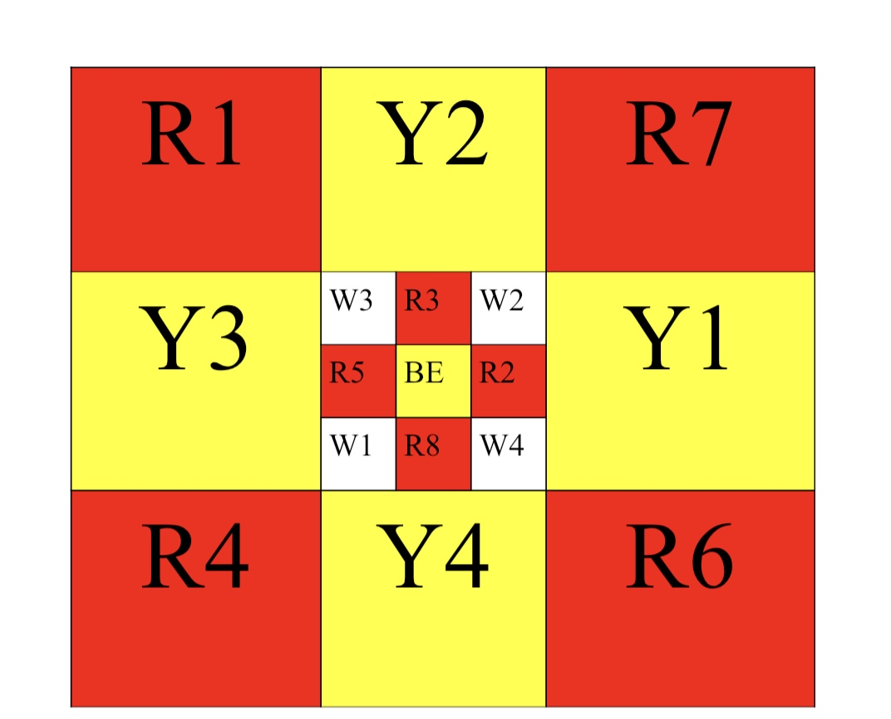
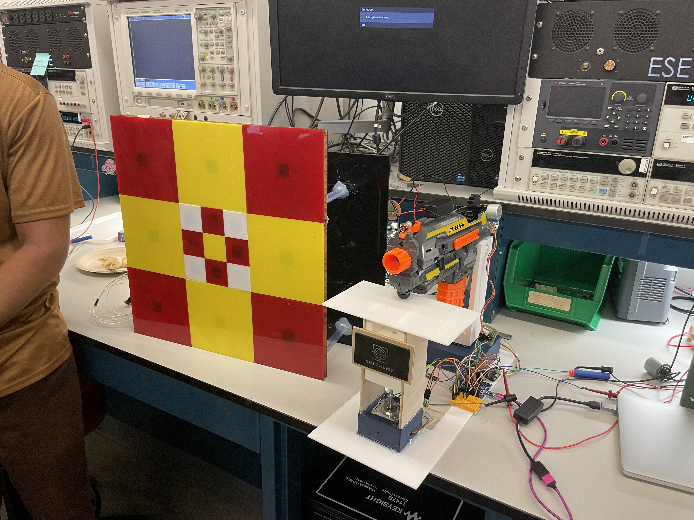
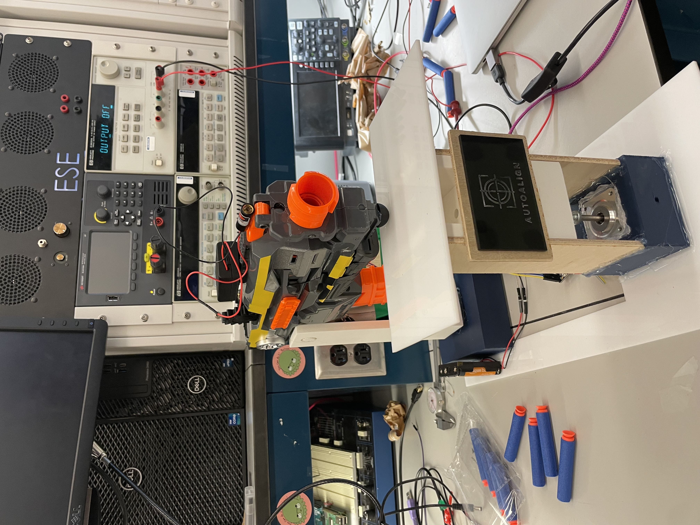

# AutoAlign

and a target that is covered in pressure sensors which send data back to the motors of the stand to readjust its positioning.

- Team Number: 3
- Team Name: AutoAlign
- Team Members: Ayan Bhatia, Matilda Dingemans, Destynn Keuchel
- GitHub Repository URL: [https://github.com/upenn-embedded/final-project-s25-autoalign](https://github.com/upenn-embedded/final-project-s25-autoalign)
- GitHub Pages Website URL: [for final submission]

  

## Final Project Proposal

### 1. Abstract

Our project is an adaptive targeting system that uses pressure sensor feedback to automatically realign a motor-controlled platform that holds a nerf gun toward the center of a target. It will consist of two functional pieces that communicate with eachother. The first will be a Nerf Toy Gun stand that can move where the Nerf Gun points up, down, left, and right. The second will be a target that is covered in pressure sensors that sends information back to the stand to so it realigns itself for the next shot to be more accurate.

### 2. Motivation

_What is the problem that you are trying to solve? Why is this project interesting? What is the intended purpose?_

The problem we are solving is the aiming of a projectile, and the purpose of our project will be to orient a nerf gun to hit a target. We are doing so by controlling a nerf gun with a 2-axis motor system informed by feedback from a peripheral target device.

  

### 3. System Block Diagram

  

### 4. Design Sketches

The motor stand will be 3D printed. We will use Solidworks to design our stand and the RPL to print. We will laser cut wood for the target to place the pressure sensors on.

Motor Stand:

Target:

  

### 5. Software Requirements Specification (SRS)

- Coordinates of impact sent from peripheral ATMega to principal ATMega
- Impact on pressure sensor must ping an interrupt in the peripheral ATMega
- The principal ATMega controls directional motors via PWM
- Principal ATMega uses a timer to pull the trigger on the nerf gun after a set amount of time of the peripheral recieving input

**5.1 Definitions, Abbreviations**

Here, you will define any special terms, acronyms, or abbreviations you plan to use for hardware

PWM - Pulse Width Modulation
SPI - Serial Peripheral Interface
RF - Radio Frequency
LDC - Liquid Crystal Display

**5.2 Functionality**

| ID     | Description                                                                                                                                                                                      |
| ------ | ------------------------------------------------------------------------------------------------------------------------------------------------------------------------------------------------ |
| SRS-01 | Impact on pressure sensor will ping an interrupt in the peripheral ATMega                                                                                                                        |
| SRS-02 | Peripheral ATMega sends pressure sensor coordinates to principal ATMega via SPI RF modules (backup will be using direct wire communication via pin-change interrupts on the principal ATMega)    |
| SRS-03 | The principal ATMega controls directional motors via PWM                                                                                                                                         |
| SRS-04 | Principal ATMega uses a timer to pull the trigger on the nerf gun after a set amount of time (for the motors to adjust) of the peripheral receiving input and outputting to the principal ATMega |
| SRS-05 | Principal ATMega will use SPI to communicate with the LCD display                                                                                                                                |

  

### 6. Hardware Requirements Specification (HRS)

**6.1 Definitions, Abbreviations**

Here, you will define any special terms, acronyms, or abbreviations you plan to use for hardware

**6.2 Functionality**
| ID | Description |
| ------ | -------------------------------------------------------------------------------------------------------------------------------------------------------------------- |
| HRS-01 | Pressure sensors will be used on the peripheral target that will signal force from projectile to peripheral ATMega |
| HRS-02 | Display connected to principal ATMega will display location and distance from center of recieved impacted projectile|
| HRS-03 | Two electronic motors will be used to control the pitch and yaw |
| HRS-04 | An electronic motor will be used to "press" the trigger of the nerf gun (or triggering mechanism will be hardwired to the ATMega) |
| HRS-05 | Nerf gun will launch projectile towards the peripheral target |

  

### 7. Bill of Materials (BOM)

_What major components do you need and why? Try to be as specific as possible. Your Hardware & Software Requirements Specifications should inform your component choices._

_In addition to this written response, copy the Final Project BOM Google Sheet and fill it out with your critical components (think: processors, sensors, actuators). Include the link to your BOM in this section._

We need two AT32Mega boards, one on the principle and one on the peripheral. Each need to also have an RF transceiver to communicate with each other. On the principle, we need an LCD screen and driver. We also need three motors, one for up/down, one for left/right, and one for the trigger. We also need a power management system for these motors, ideally a buck converter that connects to a wall outlet. On the peripheral, we need 17 pressure sensors, 9 small ones and 8 large ones to create our target pressure grid.

[https://docs.google.com/spreadsheets/d/1tAK2J1TNvOPft6oS3_Q8MS1eIg2bzJUsa1MUXQpc5uQ/edit?usp=sharing](https://docs.google.com/spreadsheets/d/1tAK2J1TNvOPft6oS3_Q8MS1eIg2bzJUsa1MUXQpc5uQ/edit?usp=sharing)

### 8. Final Demo Goals

_How will you demonstrate your device on demo day? Will it be strapped to a person, mounted on a bicycle, require outdoor space? Think of any physical, temporal, and other constraints that could affect your planning._

We can do our final demo in the hallway outside of Detkin. We would probably want to place our mount system on top of a table on one side of the hallway, and then attach our target system on top of another table on the other side. Our project would also be able to function on the ground.

  

### 9. Sprint Planning

_You've got limited time to get this project done! How will you plan your sprint milestones? How will you distribute the work within your team? Review the schedule in the final project manual for exact dates._

| Milestone  | Functionality Achieved                                                                                                                                                                                                                  | Distribution of Work                                                                                                                                                          |
| ---------- | --------------------------------------------------------------------------------------------------------------------------------------------------------------------------------------------------------------------------------------- | ----------------------------------------------------------------------------------------------------------------------------------------------------------------------------- |
| Sprint #1  | Prototype of physical stand (completed on solidworks and 3D printed), target backing laser cut, parts ordered recieved, pressure sensors recieved and tested, motors recieved and tested, decide whether the nerf gun can be hard wired | Ayan: Physical Stand Prototype Matilda: Target Backing and order parts, Destynn: Nerf Gun Hardwire, Test Sensors                                                              |
| Sprint #2  | preliminary prototype of moving aim stand, preliminary prototype of peripheral target with pressure sensors attached, wifi/communication modules recieved and tested                                                                    | Ayan: Preliminary Prototype of Moving Stand, Matilda: Preliminary Prototype of Peripheral Target with pressue sensors, Destynn: Wifi Communication + helping Matilda and Ayan |
| MVP Demo   | full prototype of moving aim stand, full prototype of peripheral target, wifi/communication modules incorporated, communication between target pressure sensors and moving stand motors                                                 | All together                                                                                                                                                                  |
| Final Demo | Tweaking accurary, fixing current problems, ensuring everything consistently works                                                                                                                                                      | All together                                                                                                                                                                  |

**This is the end of the Project Proposal section. The remaining sections will be filled out based on the milestone schedule.**

## Sprint Review #1

### Last week's progress

Ayan: Solidworks of the wedge and the mount. We decided that since the gun magazine was angled downwards, we wanted to make a wedge that can make gun fire straight instead of down. Helped build the target zone

Matilda: Ordered parts. Created a prototype target zone to do tests on and had the ATMega to print something to the terminal if the bullet hit the zone.

Destynn: Worked with RF sensors and understood how to work them and how commuication between two modules is transmitted. Helped design the new target prototype and construct it.

All of us decided that we were going to use 17 buttons over 17 pressure sensors. We thought of a new design with 4 springs and a button underneath a pad of acrylic/wood that would push the button down lightly underneath the pad. Matilda made the first prototype of the pad with the springs and tested different buttons to see which one was the best. Since the pressure sensors were originally going to be our ADC component, we are going to use buttons instead with a resistive divider circuit to complete the ADC component. Each button will be assigned to a different voltage and we will convert using ADC on the ATMega.

WORKING ON/PROTOTYPE IMAGE OF TARGET ZONE PROTOTYPE:

Here is a video of the target prototype working 80% of the time. We will need to get new softer springs as well as ensure the target hit prints every hit, and just once.

Video: [https://drive.google.com/file/d/1j0xhVTu1WuUeO6oQJYjVxc8Wiqz5kmaa/view?usp=sharing](https://drive.google.com/file/d/1j0xhVTu1WuUeO6oQJYjVxc8Wiqz5kmaa/view?usp=sharing)

IMAGE OF STAND/WEDGE IN SOLIDWORKS:

RF Module:

### Current state of project

We currently have a target zone prototype. It uses four springs in the corners of two sandwiched laser cut 1/8" acrylic pieces. The back acrylic piece has a hole in the middle that holds a button. When the gun fires at the front piece of a acrylic, the springs compresses and the button presses. With that we are then able to record whether the button has been pressed by the bullet. Our current prototype works about 80% of the time. The other 20% it does not register the hit. We will have to mess around with which springs to use, how tall to make them, and how close to place the button to the top pad. The code might also be an issue somehow, but we doubt it. There will eventually be 17 target zones. The 8 out on the outside will be bigger while the 9 on the inside will be smaller.

Ayan also created a Solidworks file of our stand/wedge that will hold the motors and toy. It has yet to be lazer cut.

We plan to order some new springs for our next prototype for the target. We also need something for the trigger of the toy, such as another motor. We will order these componenets soon.

### Next week's plan

Matilda: Tweak the current prototype to work at least 95% of the time. Build more target zones and assemble full target. Done means fully glued and constructed. Work with Destynn to use ADC to get input from different buttons. Done means ATMega can recognize different parts of the target seperately. Construction will take a few hours and then working with Destynn will take another few hours to connect the full target prototype to the ATMega.

Destynn: Build resistive divider circuit for buttons for target peripheral. Done means working in conjunction with the target Matilda will construct. Continue working on RF (Matilda will help). Resistive Circuit won't take long, doing the ADC for reading the voltages will take a little longer to ensure each target is correctly read and accurate.

Ayan: Print and Assemble Motor Stand. Attach to ATMega to control motors. Done means correct up and down movement. This will take a few seperate planning and work sessions.

## Sprint Review #2

### Last week's progress

This week, a lot was completed!

First, Ayan printed out the Nerf toy stand, which houses both the motors and the Nerf gun, and once we connect it up, it will be able to have a full range of motion in a certain direction. It has holes for the wires, and it houses the gun nicely. Here is an image of the motor stand as well as a Google Drive link to a video that demonstrates its functionality:

Link to video of it moving: [https://drive.google.com/file/d/1VINAu2DPriv7eX9o841xM5F6CaizVxNs/view?usp=sharing](https://drive.google.com/file/d/1VINAu2DPriv7eX9o841xM5F6CaizVxNs/view?usp=sharing)

Something we noted is that the stand may need to be expanded to counterweight the gun’s weight. Right now, it tilts a little because the gun hangs on a certain side where the motor connects. If we make the base wider, then it will balance better. Overall, for a first prototype, though, it works nicely.

Next, we laser cut all of the components for the target. The backing is 3 separate pieces (simply because it was too big for one sheet of acrylic), and it has 17 holes in it which signify where the buttons will sit.

Here is the front of the target. It is not assembled yet. Each piece will sit on four springs.

Then, when the bullet is fired at each square, a certain button will be pressed down.

A current issue we are facing is the ability of the gun to push the springs down completely. An idea we’ve had is to laser cut a small flat piece of acrylic that can be glued to the buttons to make them sit closer to the front pieces. That means that the bullet doesn’t have to exert as much force to press the button down. The top slab will essentially be touching the top of the button, so if it hits it, it will definitely register.

Next, as mentioned last week, we decided to use all buttons and still want to use ADC, so we settled on a resistive divider. Each button pressed will signify a different voltage. Since we didn’t want to step down 17 buttons, we've decided to use 3 ADC pins. This also allows us to register if the bullet hits between squares. No two ADC pins will touch (and the different pins are signified by the color of their front panel, so no two colors touch). So, if two buttons are pressed down because the bullet hit between them, we will be able to register that and move the motor accordingly.

Matilda worked on a schematic and prototype of this resistive divider, making sure it could print the different button presses to the serial monitor. Here is the schematic for one of the setups:

The red panels (since there are 8 of them) will need 9 resistors, which matches the schematic above. The yellow and white will both need 5 resistors, and the center piece will be its own GPIO pin for the bullseye. Here is the prototype with 8 buttons:

The breadboard setup is the prototype, while the green perfboard will be in the final design. Here is a video showing that the buttons each show different signals in the serial monitor.

Link: [https://drive.google.com/file/d/1IZJQeoeH9H_dqRwRdRc7nax1aOv_U5zq/view?usp=sharing](https://drive.google.com/file/d/1IZJQeoeH9H_dqRwRdRc7nax1aOv_U5zq/view?usp=sharing)

Then, the green board is all 3 ADC pin stages on one board. One with 9 resistors, and two with 5. It has been soldered.

What needs to be added to this is stripped wires that will be sent out to each button at each stage of the divider. Each button will be soldered with two longer wires and then placed into the target and the board, and then connected to the ATmega as well.

Lastly, Destynn figured out how our RF modules worked and was able to transmit data between a receiver and transmitter. He also helped design the target and the motor stand. Also, he helped build the resistive divider schematic.

### Current state of project

The current state of our project is looking good. We have all of our parts printed out and everything we need. The only thing we should order more of is springs. We will send out a form today for that.

We have the stand, as well as the target backing and front, and the resistive divider needs to be connected to all the buttons, but we will do that once we have decided how to ensure the bullets can press them down inside the target backing.

Once we get the motors working, the stand should be able to move the Nerf toy how we want it to, and once the buttons are placed into the target and the front pieces are glued on, it should be able to communicate with the resistive divider.

Then, once that signaling is all done, the RF modules will be able to communicate between the gun and the target and move it accordingly.

### Next week's plan

Next week's plan consists of fleshing out what we currently have.

Ayan will set up the motor with the motor drivers and the ATmega, ensuring we have proper control of movement. If the base needs to be reprinted after testing, he will either reprint it to be wider or glue it to a large flat bottom piece or stool. He will also print out the small pieces that may be attached to each button to ensure they can touch the front of the target. He will make sure the base is not tilting in one direction due to weight distribution. The definition of done here is being able to move the gun to point in different directions simply by changing code on his computer. If the motors cooperate, this shouldn't take too long, and he will also help with the target. Reprinting the base may take a bit more time.

Matilda will figure out how to properly wire all 17 buttons to the resistive divider and integrate them with the ATmega. She will solder them and attach them to the target. Once the button issue is resolved, she will glue each target front piece to the backing with the springs. The definition of done here is a full target module with all buttons placed (and able to be pressed by the bullet), soldered onto the perfboard, and successfully working with the ATmega, sending specific signals for each button. This will likely take a few work sessions, as soldering all buttons and integrating them into the perfboard is a time-consuming process.

Destynn will continue working on the RF module to ensure we can send signals between our two ATMegas. He will also help with solving the button issue and gluing the target properly. The definition of done here is having the two ATMegas communicating successfully and establishing a method to send ADC signals between them. As he is close to finishing this, he will also assist Matilda with soldering and the target setup.

For the MVP, we aim to have the motors functioning properly and the full target module operational. We hope to send signals from the target to the gun to control its movement. By final demo day, we plan to fine-tune the aiming system and ensure that even if the bullet hits between slabs, it can still register the impact and adjust accordingly for improved accuracy.

## MVP Demo

**1. Show a system block diagram & explain the hardware implementation.**

The blue represents unfinished work

**2. Explain your firmware implementation, including application logic and critical drivers you've written.**

Our firmware implementation is as follows: The target is standalone with an ATMega and an RF module attached. It has 17 buttons, which use 3 separate ADC Pins (PC0, PC4, PC5) as well as one GPIO pin for the bullseye. The buttons sit behind 17 separate laser cut acrylic pieces which are held up over the button by springs. When our nerf gun fires at the target in a certain spot, it will press down that button behind that acrylic pad.

One thing that we noted last week was that the buttons were too far away for the pads to be able to register the hits, so we added these squares that sit right in the center, that hover over where the buttons are.

The buttons use ADC by going through three resisitve dividers. Each color of the target represents a ADC pin, and no two colors touch to ensure we dont fire two at the same time and get a random voltage reading.

The buttons slot through the back of the target and are all soldered. The buttons all have a VCC pin which connect to their respective parts of the resisitve divider, and the other pin is the pin that connects to the ADC pin on the ATMega, so they are all a common node for each color.

The white and yellow modules share a perfboard while the red (which is 8 buttons) has its own.

Here is an initial test video where the oscilloscope shows the voltage jump when the buttons are pressed: [Initial Test](https://drive.google.com/file/d/1Ti1Q_aNJvFZGLuL9JDWu-jdo0Eh8TL3k/view?usp=sharing)

The final implementation of the target was able to print out the correct value wherever it hit to the terminal according to these values:

Here are images of the final constructed target

We added a backing to ensire that the bullets push the springs rather than the entire board. It made the signals pick up more consistently since the bullets fire so quickly.

Then, the RF modules are able to pick up on this transmision and send it to a separate ATMega. So if you shoot "R7" it will send "R7" to the other ATMega consistently.

More on the RF: The RF uses SPI between two ATMegas that can sit accross the room from each other. The SPI transmitter on the target ATMega is on SPI 0 so that the PC pins are free for the ADC while on the motor ATMega, the SPI pin is SPI1 so it keeps as many GPIO pins for the motor drivers as free as possible.

The code that runs the ADC button and transmission is called "ADCButton.c" and is in the github repo

The code that recieves the signal and prints it is called "RF_Reciever" and the code that recieves it and moves our motors is called "gunCode.c" and "gunCalibrate.c". These are also on our repo.

Here is a final video that walks through the target setup as well as the RF transmission and recieved message: [RF Module](https://drive.google.com/file/d/1rUKkpuHiJbicsA5cL1VGYTxgmowKyEMa/view?usp=sharing)

The last part of our project is what currently needs the most work. Our stand for our gun can sucessfuly recieve a signal from the target and move, but it is quite unsteady and does not have a lot of torque.

The two motors use PWM to control them and currently we don't have the right motor drivers to give enough current for them to be as steady as we want.

Here is a video of it somewhat working how we want with half step movement: [Motor Control](https://drive.google.com/file/d/1HDAYzmUnKHeJbwB2_LW9rC8Y2Iv4ZrEs/view?usp=sharing)

This video demonstrates the capability to move both up and sideways at the same time, emulating diagonal movement.

We've set up code for it to be able to move according to where the target is set and it is in our repo, but still, the gun is too unsteady, so we plan to add a gear box and more stability.

**3. Demo your device.**

Done in class, see full video (same as above): [Video](https://drive.google.com/file/d/1rUKkpuHiJbicsA5cL1VGYTxgmowKyEMa/view?usp=sharing)

**4. Have you achieved some or all of your Software Requirements Specification (SRS)?**

Our SRS (Modified to fit buttons over pressure sensors)

| ID     | Description                                                                                                                                                                                                                                             |
| ------ | ------------------------------------------------------------------------------------------------------------------------------------------------------------------------------------------------------------------------------------------------------- |
| SRS-01 | Impact on a target module square will press the button underneath, and send a certain ADC signal to the peripheral ATMega which can be decoded to that specific button                                                                                  |
| SRS-02 | Peripheral ATMega sends button coordinates (color and number) to principal ATMega via SPI RF modules                                                                                                                                                    |
| SRS-03 | The principal ATMega controls directional motors via PWM based on which button was sent from the target hit and aims more towards the center                                                                                                            |
| SRS-04 | Principal ATMega uses a timer to pull the trigger on the nerf gun every 5 seconds (time for the motors to adjust) of the peripheral receiving input and outputting to the principal ATMega. The trigger will be pulled using a servo controlled by PWM. |
| SRS-05 | The ATMega will be able to turn on and off the motor control inside the gun to initiate the sequence.                                                                                                                                                   |
| SRS-06 | (Optional) LCD Screen to show where the bullet made contact with the board.                                                                                                                                                                             |

We have achieved nearly all of our SRS. We have achieved 1,2 and 3 partially and 4 and 5 (and maybe 6) will be completed this week.

We have achieved impact on the button sends a specific signal to the ATMega. The RF module sends the signal from one ATMega to the other that controls the motor. The Principle ATMega sucessfully moves our motor stand based on signals we send it via PWM.

1.  Show how you collected data and the outcomes.

As explained in the firmware explanation: each target piece has a button behind it, that is triggered when the bullet hits it. Each button can be separately registered and sent over RF. There is a video that shows this in its entirety above. The motors are still a little unsteady but we could see the target sending a signal to the motor because the motor was drawing current whenever we pressed a target module.

**5. Have you achieved some or all of your Hardware Requirements Specification (HRS)?**

Our HRS (Modified)
| ID | Description |
| ------ | -------------------------------------------------------------------------------------------------------------------------------------------------------------------- |
| HRS-01 | 17 Buttons will be used on the peripheral target that will signal force from projectile to peripheral ATMega |
| HRS-02 | LCD Display connected to principal ATMega will display location and distance from center of recieved impacted projectile|
| HRS-03 | Two electronic motors will be used to control the pitch and yaw |
| HRS-04 | An electronic motor will be used to "press" the trigger of the nerf gun (or triggering mechanism will be hardwired to the ATMega) |
| HRS-05 | Nerf gun will launch projectile towards the peripheral target |

Similarly to SRS, we have completed and tested the buttons, and motors. The buttons work well and all register as we want, while the motors still need work. They can hold the gun up and turn, but very slowly and often falls. We will need to work most on triggering the gun with a separate servo motor as well as making the stand more steady to ensure the movement is accurate

Similarly to SRS, we have completed and tested the buttons, and motors. The buttons work well and all register as we want, while the motors still need work. They can hold the gun up and turn, but very slowly and often falls. We will need to work most on triggering the gun with a separate servo motor as well as making the stand more steady to ensure the movement is accurate

1.  Show how you collected data and the outcomes.

See videos in firmware explanation

**6. Show off the remaining elements that will make your project whole: mechanical casework, supporting graphical user interface (GUI), web portal, etc.**

The target is practically complete, and all of the pieces are printed. The remaining elements are:

1. Fixing the motor stand to move correctly when we send a signal to it. It can recieve the signal well, but making it move correctly is not working as well as it is unsteady. It will help when our new motor drivers arrive.
2. We also need to work on making the trigger motor with a separate servo motor to ensure we do not have to touch it as it runs to make it as accurate as possible.
3. We will also add functionality to ensure that if a bullet triggers two buttons (hits in between) it can understand where it hit more clearly and move accordingly
4. Optionally: adding an LCD screen to show where the bullet hit.

**7. What is the riskiest part remaining of your project?**

The trigger for the gun being automatic. It will be difficult to do this because we need to find a way to both activate the power from the ATMega and press the mechanical switch without physically touching the gun or misaligning it. Another risky part is the stand that we need to somewhat redesign. We need to add a gear box to up the torque.

1. How do you plan to de-risk this?
   One option is hardwiring, and our backup option is just phsically actuating it. We will use servos to pull the trigger button and use the ATmega to turn on the motors inside the gun. In terms of the stand, starting early!

**8. What questions or help do you need from the teaching team?**

We might need some help with the gearbox, but I think for now we have it covered!

## Final Project Report

### 1. Video

[https://drive.google.com/file/d/1Y7Iry1P9N2BuDRim6GBoatGdywvc1A73/view?usp=sharing](https://drive.google.com/file/d/1Y7Iry1P9N2BuDRim6GBoatGdywvc1A73/view?usp=sharing)

### 2. Images

### 3. Results

_What were your results? Namely, what was the final solution/design to your problem?_

#### 3.1 Software Requirements Specification (SRS) Results

_Based on your quantified system performance, comment on how you achieved or fell short of your expected requirements._

We met all our expectations.

_Did your requirements change? If so, why? Failing to meet a requirement is acceptable; understanding the reason why is critical!_

We removed a requirement to use an LCD screen because it was uneccessary (we talked it over with our paired TA) and removed a requirement that the ATMega turns the motors on and off because it was redundant. We added a requirement that the RF receive uses interrupts because we realized that polling would cause issues in conjunction with stepper motor movement. We also added some more specifics in general to our requirements to make them more quantifiable, such as motion and trigger timing.

_Validate at least two requirements, showing how you tested and your proof of work (videos, images, logic analyzer/oscilloscope captures, etc.)._

| ID     | Description                                                                                                                                                                                                                                                                | Validation Outcome                                                                                                                                                                                                                                                                                                                                 |
| ------ | -------------------------------------------------------------------------------------------------------------------------------------------------------------------------------------------------------------------------------------------------------------------------- | -------------------------------------------------------------------------------------------------------------------------------------------------------------------------------------------------------------------------------------------------------------------------------------------------------------------------------------------------- |
| SRS-01 | Impact on a target module square will press the button underneath, and send a scaled ADC signal to the peripheral ATMega which will be decoded to identify that specific button. For the bullseye it, it should use GPIO.                                                  | All 17 panels on the target map to an individual button (and trigger the button when press). Two sets of eight bottons are mapped together through a resistor divider to determine the actuated button through ADC. The code can be seen in the "FINAL_targetCode.c" file. The target design can also be seen in the previous pictures and videos. |
| SRS-02 | Peripheral ATMega sends button coordinates (color and number) to principal ATMega via SPI RF modules within a reasonable amount of time after receiving the ADC signal                                                                                                     | The principal and peripheral ATMegas both had connected nRF24L01+ RF modules via SPI, and in the MVP video, it was demonstrated that when the target was hit, the peripheral ATMega sent the label of the hit panel to the principal ATMega via RF                                                                                                 |
| SRS-03 | The principal ATMega controls directional motors via PWM based on which button was sent from the target hit and aims more towards the center. Motion should take less than 6 seconds.                                                                                      | Implemented as described in the description of the specification. The movement of the motors can be seen in the demonstration video. The movement met the timing requirement.                                                                                                                                                                      |
| SRS-04 | Principal ATMega uses a timer to pull the trigger on the nerf gun every ~7 seconds (including time for the motors to adjust) of the peripheral receiving input and outputting to the principal ATMega. The trigger will be pulled using a third stepper controlled by PWM. | Implemented as described in the description of the specification. The movement of the trigger rail can be seen in the demonstration video. The trigger timiming met the requirement.                                                                                                                                                               |
| SRS-05 | The RF receiver will trigger an interrupt when data is received from the target ATMega peripheral                                                                                                                                                                          | The RF receiver was implemented using interrupts as can be seen in the "FINAL_motorCode.c" and "InterruptRFReceive.c" files                                                                                                                                                                                                                        |

#### 3.2 Hardware Requirements Specification (HRS) Results

_Based on your quantified system performance, comment on how you achieved or fell short of your expected requirements._

We met all our expectations.

_Did your requirements change? If so, why? Failing to meet a requirement is acceptable; understanding the reason why is critical!_

We removed a requirement to use an LCD screen because it was uneccessary (we talked it over with our paired TA). We added a requirement to implement a capacitor de-noise circuit for the receiver RF because we realized that was necessary for RF receiver functionality. We reworded requirements for clarity and added details to make them more quantifiable, such as the nerf toy launching a projectile at a target over 8 feet away.

_Validate at least two requirements, showing how you tested and your proof of work (videos, images, logic analyzer/oscilloscope captures, etc.)._

Our HRS (Final)
| ID | Description | Validation Outcome |
|---------|------------------------------------------------------------------------------------------------------------------------------------------------------------------------------|--------------------|
| HRS-01 | 17 Buttons will be used on the peripheral target that will signal force from projectile to peripheral ATMega | 17 buttons were implemented on the target as can be seen in the demo video and previous attached pictures of the target |
| HRS-02 | Two stepper motors will be used to control the pitch and yaw | Two stepper motors were used to control the up-down (pitch) and left-right (yaw) motion for the toy as can be seen in the demo video and previous attached pictures of the toy mount |
| HRS-03 | A stepper motor will be used to “press” the trigger of the nerf gun (or triggering mechanism will be hardwired to the ATMega) | A stepper motor was used to guide a rail that pushed the bullets into the nerf toy projectile accelerating mechanism as can be seen in the demo video |
| HRS-04 | Nerf gun will launch projectile towards the peripheral target, over 8 feet away | The projectile was launched accross the Detkin lab benches, which are over 8 feet apart as can be seen in the demo video |
| HRS-05 | RF receiver module will use capacitor circuit for noise reduction | The nRF24L01+ RF receiver module utilized a two-capacitor de-noising circuit as can be seen in the picture below from the principal ATMega mini breadboard |

Two-capacitor de-noise circuit for RF receiver.

### 4. Conclusion

**What did you learn/gain from it?**

- This project helped us learn about numerous embedded software systems. Before this, we had never worked with RF modules, nor very much with motors. Some of the previous lab components had some basic motor coding, but this project really got down to the precise movement of the stepper motors we used, which allowed for extreme precision. We also learned about how important ideating is before building. There were multiple times where we implemented ideas and made them partially permanent (such as using super glue) before properly testing them. For example, the first four buttons we put in the target were too low down from the springs, so it made it really difficult for the bullet force to press them in, but they were all superglued in, so we had to break them out using heat and chip off parts of our backing board. If we had used a less permanent seal and then tested, it would have been a lot easier to fix.

**What went well?**

- The project overall went very well! While there were some longer nights, we got all of our requirements working, and the full loop of the system (as in, fire, hit, move, adjust, repeat) worked really well. While the gun being inaccurate was our main bottleneck, that was out of our control, and all of the items we implemented were quite effective. The RF modules worked really well together and sent and received signals very quickly to ensure the movement wasn't delayed for a long time. Another part of the project that went well was the Up/Down motor system as well as the trigger mechanism. While these both took some ideating, we ultimately had systems that had precise (86 nm) movement, and a trigger mechanism that successfully pushed the bullet into the chamber so it could be fired multiple times in a row without us having to interact with the system at all.

**What accomplishments are you proud of?**

- We are most proud of all of our components working together after working separately. We had a good motor stand, a working target module, and RF working, and then when we were able to write code that seamlessly integrated all of them to work in the looping system, it was extremely satisfying. Seeing the bullet hit the top middle target module and move down right to the middle and hit the middle without us interacting with the system at all was very exciting!

**Did you have to change your approach?**

- We had to significantly change our approach from the original motor stand idea. Originally, the design was very unbalanced, with one motor sitting on top of the other, which prevented precise control and caused torque issues. We then decided to split the motors into two separate modules that sat on the tabletop. Next, we needed to address the challenge of converting rotational motion into up-and-down movement. We decided to use a nut and bolt mechanism, where the bolt was attached to the motor and moved up and down along a stand that the top of the motor sat on. This allowed us to achieve extremely precise vertical movement. Finally, we placed the nose of the gun on a smooth acrylic flat top, allowing it to move left and right easily. We considered adding a wheel to further reduce friction, but the acrylic surface was already sufficiently smooth.

**What could have been done differently?**

- Two things that could have been done differently are using pressure sensors instead of buttons for the target, and using a nut and bolt setup for the left and right motor as well, so we could have had the same level of precision for both axes. Pressure sensors would have eliminated some of the issues we had where the bullets did not apply enough force for the buttons to fully press down, or did not register because they pressed down too quickly. If we had used pressure sensors, it would have always registered, and we would have had more control over where on the sensor it was hit. In terms of the left-right movement, using a nut and bolt setup would have given us much more control, as the left-right movement we ended up with was somewhat volatile and inconsistent.

**Did you encounter obstacles that you didn’t anticipate?**

- One of the main obstacles was the Nerf gun bullets being inconsistent. With a project that relies on precision, we would have wanted to create a system that didn't rely on the bullets firing in random directions. Unfortunately, because the firing direction varied slightly from shot to shot, it made it harder to consistently hit the target, adjust for it, and have it hit exactly where we adjusted it to. While we were able to design the motors and movement system to adjust and compensate as much as possible, the randomness of the bullet paths was something that we couldn't fully control.

**What could be a next step for this project?**

- In order to remove more of the randomness, we would have wanted a more accurate firing tool. Perhaps we could create our own firing tunnel with servos inside it, making it both more powerful and more accurate. This would help ensure the bullet can push the buttons properly and be more reliable overall. Another possible next step could be adding a vision system, such as a simple camera to detect the exact location of the target and adjust the aim dynamically before firing.

## References

Fill in your references here as you work on your final project. Describe any libraries used here.

We did not use any external libraries.
